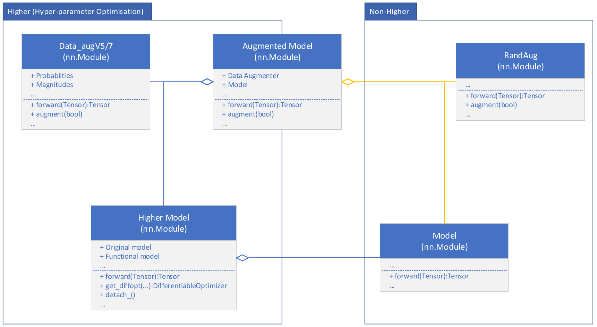
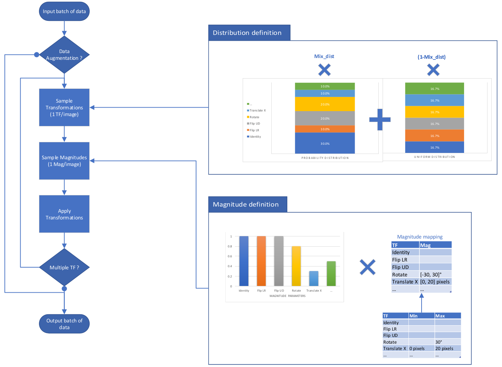
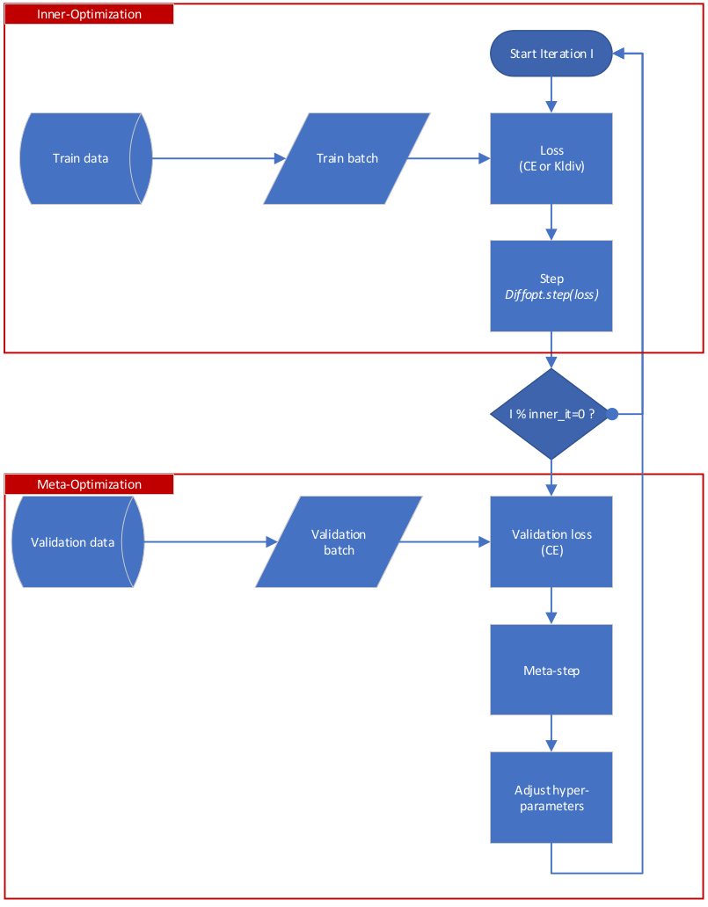

----------------
'Smart_aug' objective is to make data augmentation differentiable, thus allowing to learn its parameters, with 'Higher' objects, such as 'Data_aug' classes. The meta-learning of the data augmentation parameter is performed jointly with the training of the model. Thus it minimize the overhead compared to other data augmentation learning techniques.

**Beware** that the Higher Model keep in memory states of the model and optimizer. Meaning that it's memory footprint keeps increasing at each steps. Be sure to call the 'detach_()' method to limit the number of states held.

It's also possible to use the, non-differentiable, data augmentation module 'RandAug' which is an implementation of RandAugment. That can be used as a baseline that is less computationnally and memory intensive.

# Requirements and Installation

* Python version >= 3.5
* PyTorch version >= 1.3
* Kornia version >= 0.2.0
* Higher version >=

* Optionnal:
..* matplot >=

## Kornia

'pip install kornia' (Stable ou Github ?)

## Higher

'git clone git@github.com:facebookresearch/higher.git
cd higher
pip install .'

## Optionnal

For graphical results:
'pip install matplotlib'

# Data augmentation 
## General approach

'Data_aug' and 'RandAug' modules are the main modules of this repo. Their main use is to take batch of data and transform them to improve the generalization of the model. See below the forward principle of this modules :

'RandAug' difference is that it's non-differentiable thus it keeps a uniform transformations distribution, as well as initial magnitudes parameters.

## Transformations

Transformations in this module needs to be differentiable, ie. allow back-propagation of a gradient, to learn the magnitude parameters. It's also highly recommended to use Tensor based transformations to prevent massive slow-down on batch transformations.

We mostly rely on 'Kornia' library as well as 'PIL' inspired implementation to define diffrentiable transformations.
The following differentiable transformations are available:
* Geometrical transformations :
..* 'Rotate'
..* 'TranslateX'
..* 'TranslateY'
..* 'ShearX'
..* 'ShearY'
* Color transfornations :
..* 'Contrast'
..* 'Color'
..* 'Brightness'
..* 'Sharpness'

The following Tensor based transformations are available:
* 'Identity'
* Geometrical transformations :
..* 'FlipUD' (Up-Down / Vertical)
..* 'FlipLR' (Left-Right / Horizontal)
* Color transfornations :
..* 'Posterize'
..* 'Solarize'

A side effect of these Tensor based transformations is that they will outperform, in terms of speed on GPU, their non-PyTorch version as the sized of the images batches increase.

**Please note** that each has defined fixed bound for it's magnitude parameters in 'transformtions.py'. This values are inspired from 'AutoAugment' but it could be needed to change those (especially for images size different from 32x32 pixels). See below the default values used :

Transformation | Min | Max
--- | --- | ---
'Rotate' | -30 | 30
'TranslateX' | -20 | 20
'TranslateY' | -20 | 20
'ShearX' | -0.3 | 0.3
'ShearY' | -0.3 | 0.3
'Contrast' | 0.1 | 1.9
'Color' | 0.1 | 1.9
'Brightness' | 0.1 | 1.9
'Sharpness' | 0.1 | 1.9
'Posterize' | 4 | 8
'Solarize' | 1 | 256

Those parameters needs to be float value to allow differentiable transformations.

There's also other transformations available in 'transformations.py' but they're mostly intended to test purposes and not recommended in general.

# Example Usage
## Optimization process

'Smart_aug' aim to learn data augmentation parameters which can be viewed as hyper-parameters. This techniques is a specific case of meta-learning based on validation data and performed jointly with classic learning. 
We rely on the 'Higher' library to solve this bi-level optimisation problem. See below for the detailled optimization process:

## Code example

An example use of Smart_aug can be found in 'test_dataug.py' with Augmented model, and 'run_dist_dataugV3' in 'train_utils.py'.